[回首頁](../index.md)
# 一起來畫圖
**協同作業**是開放原始碼(Opensource)專案中常見的運作方式，在[衛福部資訊處 *龐一鳴處長* 高呼-醫療上雲](https://www.cio.com.tw/pang-yuming-data-security-cloud-up-medical-ai-as-governors-second-pulse/?utm_source=line&utm_medium=live&utm_campaign=220523)及受疫情干擾之際，「*遠距工作、橫向溝通、斜槓技能*」就顯得份外重要，歡迎大家一起來畫圖，邁向雲端之路。

- **本專案使用 markdown[^1] 撰寫說明文件及 drawio 繪製 SVG[^2] 格式圖片**
- **本專案所有文件及圖表全部使用 vscode + drawio套件[^3]撰寫**

## 你需要準備的工具及具備的知識



### 1. 註冊 github 帳號
- 若您想要嘗試協同畫圖，開始之前請先到[這裡](https://github.com/signup?ref_cta=Sign+up&ref_loc=header+logged+out&ref_page=%2F&source=header-home)註冊一個 github 帳號


### 2. 安裝 vscode
功能強大且免費使用的文字編輯器，是許多開發者的最愛。
- 一般使用者也可以用它來解決文字編輯的疑難雜症。
- 從[這裏下載](https://code.visualstudio.com/)安裝。

**vscode 參考畫面**


**提示**
安裝完成 vscode 第一次啟動時，若你是中文版作業系統，應會自動提醒是否安裝中文套件。

### 3. 安裝 git 軟體
git 是文字檔案內容版本控制的軟體，經常被使用在程式開發的原始碼管理，由於它只針對文字內容做比對，因此，本專案的繪圖協作就採用可縮放向量圖片格式(SVG)來實作圖片版次的管控。

- 版本控制
- 合併請求

協作時，為了做檔案的版本控制，開始之前，我們也須先安裝 git 軟體，以利我們將專案複製(clone)到本地端的電腦，使用 vscode 進行畫圖(drawio)或編寫文字內容。

如果你使用 macOS，只要開啟終端機(Terminal)程式，輸入 git 後按「Enter」，系統就會提示你要安裝 xcode，並依照提示安裝，就可安裝完成了。


如果是其他作業系統，請到[git 安裝程式下載](https://git-scm.com/download)，並依照您電腦的作業系統，下載對應的版本安裝。


- 若您有安裝上的問題，可以看看 [windows 上的 git 安裝教學](https://w3c.hexschool.com/git/3f9497cd)參考，或是[留言發問](https://github.com/losehrt/nhi_flows/discussions/new)。

- 補充說明：Apple Mac 使用者，安裝時可能會碰到一些障礙，不知道要用命令安裝或是執行檔安裝，對初學者建議 [ 點這裡下載 dmg 安裝 ](https://sourceforge.net/projects/git-osx-installer/)，安裝過程會有一些安全性的提示，請到「系統偏好設定/安全性與隱私權」選項強制執行即可。如下圖所示：


- 最後，我們可以檢查看看，您電腦的 git 是否安裝成功？請開啟終端機，並執行執行下列指令：
```
# 檢查 git 版本
git --version
```
```
# 結果輸出
git version 2.24.3 (Apple Git-128)
```

### 4. 安裝 drawio 套件
drawio 是一套功能強大且免費使用的線上繪圖軟體，可以快速繪製出流程圖(flowchart)或資訊圖表(Infographic)，內建有多種元素及各式樣板，並提供 png, svg 等多種圖片格式匯出功能，習得此軟體保證值回票價，您可以先[前往該網站](https://app.diagrams.net/)試試。

**drawio 參考畫面**


**本專案的目的，就是使用 vscode + drawio [^3]直接繪製出所需要的圖表，儲存為可縮放向量圖(SVG[^2])，並直接顯示在 github 網頁(gh-pages)。**

如果您對 vscode drawio 的使用還有些陌生，網路上有一些教學，建議您先去看看再回來喔！
  1. [vscocde + drawio 安裝網路教學](https://ithelp.ithome.com.tw/articles/10236346)
  2. [drawio vscode 套件影片教學](https://youtu.be/AdrFG7sq1d4)


### 5. 複製分支成為自己的專案

- [複製專案的快速連結](https://github.com/losehrt/nhi_flows/fork)(須先登入 github)

- 或是您也可以登入 github 網站後，再複製專案，步驟如下圖所示：
  1. 搜尋「nhi_flows」專案
  2. 點取該專案後，點取右上角「fork」，按建立即可

｀
｀


### 6. 將專案載入 vscode
當所有準備工作都已經完成之後，我們可以開啟 vscode(假設您已經根據上一小節所述，已安裝 vscode 及 drawio 套件)，如下圖所示：


你可以直接
- 從 Github 複製
- 自己複製網址，如： https://github.com/NickleCheng/nhi_flows.git

**如果您並不排斥使用命令列，也許事情會變得簡單**
請打開終端機畫面，輸入下列命令：

```
git clone https://github.com/NickleCheng/nhi_flows.git
cd nhi_flows
code .
```

**MAGIC** 您將會發現結果應該跟前面一樣。

當您將遠端的專案複製(clone)到本地端的 vscode 之後，就可進行編輯檔案或修改圖片，您可以**盡情的修改或任意刪除檔案**，因為，您本地端的檔案在**沒有上傳及合併之前，完全不會影響遠端的內容**。

### 7. 上傳(Push)

當修改的圖片或及說明告一段落，或是想將本地端修改的內容併回原來專案時，有兩個選擇一個是命令列，另一個則是視覺化的版本

1. 以命令列方式上傳專案：
請在 vscode 裏面開啟終端機(terminal)，然後輸入下列三行指令即可。

```
git add .
git commit -m "更新流程圖"
git push
```
2. 視覺化方式上傳
若要使用視覺化的方式上傳專案，需先安裝一個叫做 **Git Graph**  的 vscode 套件。安裝方式與之前安裝 drawio 套件相同。


### 8. 請求合併(Pull Request)


[^1]: [markdown 編寫及語法](https://docs.github.com/en/github/writing-on-github/getting-started-with-writing-and-formatting-on-github/basic-writing-and-formatting-syntax)
[^2]: [SVG 檔案](https://www.adobe.com/tw/creativecloud/file-types/image/vector/svg-file.html)
[^3]: [vscode drawio 套件](https://github.com/hediet/vscode-drawio)


